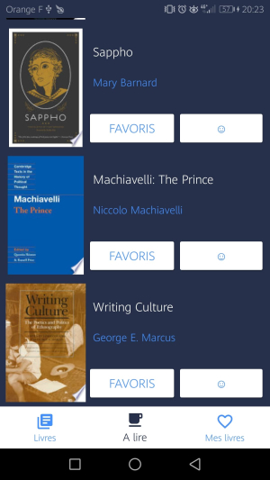

# Book-Time

## Description du projet

_Book Time_ est une application mobile "bibliothèque". Cet application est codée en Java et utilise l'architecture MVC.

## Consignes et fonctionnalités

- 2 activités et 3 fragments
- RecyclerView
- Appel webservices à une API REST : Google Books
- SharedPreferences pour la sauvegarde des listes secondaires : "favoris" et "à lire"
- Architecture MVC
- GitFlow
- Material Design

### Liste de livres

Liste de livres récupérée via l'API Google Books. On peut ajouter un livre aux deux listes secondaires :"favoris" et "à lire". La liste des livres est paginée. On peut obtenir un détail sur un livre en cliquant sur son titre.

### Liste "favoris"

  

Lorsqu'un livre est ajouté ou supprimé de la liste "favoris", un _Toast_ apparaît pour nous notifier du changement. La liste "favoris" est sauvegardée via les SharedPreferences. On peut toujours accéder au détail d'un livre via cette liste.

### Liste "à lire"

  

Lorsqu'un livre est ajouté ou supprimé de la liste "à lire", un _Toast_ apparaît pour nous notifier du changement. La liste "à lire" est sauvegardée via les SharedPreferences. On peut toujours accéder au détail d'un livre via cette liste.

### Détail d'un livre

    

On accède au détail d'un livre via n'importe quelle liste. Un livre est détaillé comme suit :
- Titre
- Image
- Sous-titre
- Auteur(s)
- Catégorie(s)
- Editeur
- Date de publication
- Description
- Nombre de pages
- Langue

La section "description" peut être augmentée / réduite.

    

A la suite de ces détails, il y a 6 boutons liés au livre permettant d'accéder à différentes pages :
- Acheter : page google play où acheter le livre (screen 1)
- Epub : télécharge le fichier epub du livre
- Pdf : télécharge le fichier pdf du livre (screen 2)
- Online : lien pour lire le livre en ligne
- Preview : page books.google.fr à propos du livre (screen 3)
- Info : informations détaillées sur le livre

